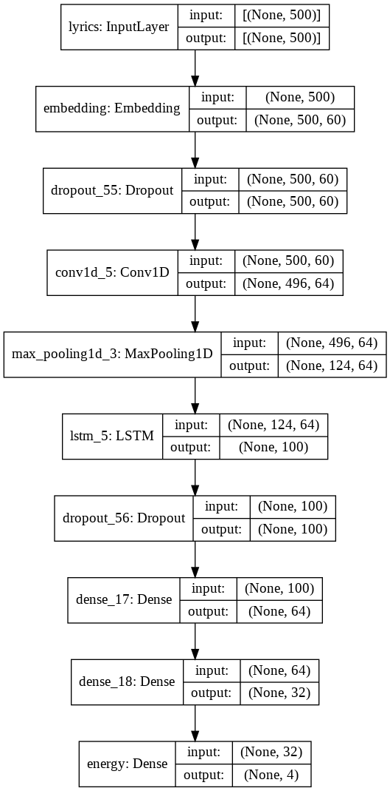

# MoodSpace - A Spotify Soundtrack Generator by Kendall Arata, Ben Brill, and Michael Ting

## Overview:

MoodSpace is a webapp that not only generates a comprehensive take on a user’s Spotify music tastes, but it also creates a customized playlist of songs to a user’s favorite movie. Using machine learning to pair song and movie moods, our Soundtrack Generator is able to analyze and curate a customized soundtrack playlist to the mood of your favorite film. 

Our app is designed for active Spotify users and movie lovers looking to discover how their music tastes match their favorite movies. To try it, see directions below.

## Directions for serving locally

1. Clone this repository to your local drive
2. Create a virtual enviornment within the repository
    1. install `vituralenv` following [these](https://packaging.python.org/guides/installing-using-pip-and-virtual-environments/) instructions
    2. Create a virtual enviornment for the repository by running the following in the command line:
    ```
    python3 -m venv env
    ```
3. Download necessary packages to virtual enviornment by running in the command line:
```
pip install -r requirements.txt
```
4. Serve app locally by running the following in the command line
```
python app.py
```
## How the Algorithm works

Spotify has several different metrics it measures for each song on it's API. For instance, if we wanted to see the statistics for the song "Waiting on the World to Change" by John Mayer, we find the following:
```python
[{'danceability': 0.514,
  'energy': 0.73,
  'key': 1,
  'loudness': -5.934,
  'mode': 1,
  'speechiness': 0.0598,
  'acousticness': 0.00146,
  'instrumentalness': 9.54e-05,
  'liveness': 0.0897,
  'valence': 0.334,
  'tempo': 171.005,
  'type': 'audio_features',
  'id': '0VjIjW4GlUZAMYd2vXMi3b',
  'uri': 'spotify:track:0VjIjW4GlUZAMYd2vXMi3b',
  'track_href': 'https://api.spotify.com/v1/tracks/0VjIjW4GlUZAMYd2vXMi3b',
  'analysis_url': 'https://api.spotify.com/v1/audio-analysis/0VjIjW4GlUZAMYd2vXMi3b',
  'duration_ms': 200040,
  'time_signature': 4}]
```
However, movie scenes obviously do not have these same metrics, because they do not have any musicality that can be measured, only dialogue. To bridge the gap between movie and song, we must provide to a model some sort of medium that both movie and songs share. Luckily, both have some form of text. For songs, it is the lyrics, and for movies it is the screenplay text. 

With this in mind, we can now develop an idea of what the inputs and outputs of our model should be. The input of our model should be some sort of text, whether that be lyrics or screenplay. The output should be a given set of Spotify metrics. We can train our model using song lyrics as input variables and their respective Spotify Metrics as target variables. From there, we can apply this model to given screenplays to predict what the Spotify metrics *would* be given the text composition of that scene. Now that we have metrics for both songs and screenplays, we can compare the two to see which songs are most alligned to a selected scene's screenplay. 

### Model Details

We implemented the above model infastructure using a `tensorflow.keras` neural network. Prior to actually inputing the text into the model, it must be vectorized, using the tensorflow `TextVectorization` function, which returns a vector that represents the words contained within a given song or screenplay in a tokenized form. Once this is complete, we can feed this tokenized vector into our neural network. An outline of our model's structure is shown below.


Let's highlight a couple of key features of this model.

#### Embedding Layer
The embedding layer takes an input of a vector representing a tokenized string and converts it into a vector in `n` dimensional space. We chose `n = 60`. This enables our model to visualize where each of our texts might lie in this space, and thus determine connections and patterns between them to output to subsequent layers of our model.

#### Dropout Layer
These layers are placed at various locations in the model to "dropout" some of the connecting neurons within the network, to prevent overfitting.

### Model Training

We trained our model on a random set of songs in the Spotify API who had English lyrics on Genuis API. The target was set as the Spotify Metrics `energy`, `valence`, `tempo`, and `liveness`. These were the results of our final epochs in fitting the model. 
```
Epoch 96/100
20/20 [==============================] - 0s 18ms/step - loss: 3.0470 - root_mean_squared_error: 8.1394 - msle: 0.0215 - val_loss: 6.6334 - val_root_mean_squared_error: 16.1454 - val_msle: 0.0440
Epoch 97/100
20/20 [==============================] - 0s 17ms/step - loss: 2.8837 - root_mean_squared_error: 7.5734 - msle: 0.0235 - val_loss: 6.6817 - val_root_mean_squared_error: 16.3202 - val_msle: 0.0332
Epoch 98/100
20/20 [==============================] - 0s 18ms/step - loss: 2.9758 - root_mean_squared_error: 7.7834 - msle: 0.0195 - val_loss: 6.6687 - val_root_mean_squared_error: 16.2802 - val_msle: 0.0413
Epoch 99/100
20/20 [==============================] - 0s 18ms/step - loss: 2.9249 - root_mean_squared_error: 7.6847 - msle: 0.0204 - val_loss: 6.7425 - val_root_mean_squared_error: 16.6854 - val_msle: 0.0343
Epoch 100/100
20/20 [==============================] - 0s 18ms/step - loss: 4.4713 - root_mean_squared_error: 13.9385 - msle: 0.0560 - val_loss: 6.8692 - val_root_mean_squared_error: 17.4515 - val_msle: 0.0566
```
Losses are relatively low, as is our Mean Squared Logistic Error, on both the training and validation data. Once the model was fitted, we saved the weights and used them to predict the `energy`, `valence`, `tempo`, and `liveness` of our given movie scences.

### Finding Song Matches

Now that we have metrics for both our songs and screenplays, we must develop some sort of way to determine which songs are most similar to which scenes. We can do this by computing the norm between the metrics of each song to a selected movie scene, which is essentially the distance between two points in $ n $ dimensional space. 

First, we take the user's top 20 songs. An random offset is applied to generate a unique list of songs each time the user uses the web app, but this list will not include any songs above their top 70 most listend to tracks. We then run our model on the song lyrics to generate the predicted metrics corresponding to the subject of the song. Though the songs already contain Spotify metrics, we wanted to use metrics generated by the lyrics of the text, as to match the subject of a song to the subject of a movie scene, rather than match the musicality of a song to a movie scene. 

Once these metrics are calculated, we compute the norms of each of these to the metrics of a user's selected movie scene. We then take the three songs with the lowest norms (or distances to the movie metrics) and display them to the user as their song suggestions! 

## Limitations
- Number of movie scripts being analyzed is limited
- Creating a custom Spotify playlist involves having acccess to and managing a user's Spotify account, and this could raise privacy issues.
    - Spotify playlist creation functionality is currently disabled. Songs are individually embedded into the website.
- Types of movie scripts are variable and not all aspects (i.e. stage direction) are included in each script
- ML algorithm is trained primarily on English songs
- Soundtrack limited to 3 songs only (for now)
